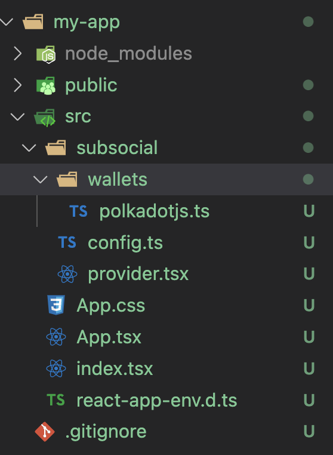

### Get started building on Subsocial quickly using the Subsocial Starter

**Subsocial Starter** is a create-react-app template that gives you an initial template to start building on Subsocial. It has all of the necessary dependencies and configurations that are required to quickly start.

:::info

The Starter is the foundational layer for using the Subsocial JS SDK in a React app.

:::

The Starter template provides the following features:

- Installed package dependencies like **@subsocial/api** and **@polkadot/api**
- API Configurations for **Testnet** and **Mainnet** to switch easily
- React context hooks for Subsocial APIs automatically connects and exposes necessary methods
- Polkadotjs Wallet methods to easily fetch connected accounts and send transactions for signing

### Create a new project

Open the terminal, and run the following command:

```typescript
  npx create-react-app my-app --template @subsocial/starter
```

Now, the project is created inside the `/my-app` directory.

Next, run the following command in the terminal:

```typescript
  cd my-app && yarn
```

> Make sure you use `yarn` to install all dependencies, npm might not work.

Update `package.json` file with the project details. 

### Running a new project

To run a new project, just do:

```typescript
  yarn start
```

### About the project structure

Understanding the project structure:

- The **config.ts** file contains the objects to connect to different networks like the Subsocial Testnet and Mainnet. 

- The **provider.tsx** file contains the context provider & hook for Subsocial related methods like:
```js
export default { isReady, api, initialize, network, changeNetwork, setupCrustIPFS }
```
- The **polkadotjs.ts** file exposes methods for connecting and getting data from the polkadot.js wallet extension.

```js
export default { logTransaction, getAllAccounts, signAndSendTx }
```



### How to build using the Starter

Once the project is setup, you can go through the **App.tsx** file that contains the basic usage of connecting to the testnet, fetching a space, and creating a new space.

Now, you can start exploring the ideas and build on Subsocial.

We have list of methods to read and do transactions on chain. Try out the code snippets in the [**Subsocial Playground**](https://play.subsocial.network)

The following pointers to have in mind: 
- Build on the **Testnet** first. And get some test tokens [here](/docs/develop/getting-started/testnet)
- Before experimenting locally, try the code snippets on the [Playground](https://play.subsocial.network)
- Go through [bounties](https://github.com/dappforce/subsocial-bounties) repository, to get some project interesting project ideas
- Facing issues? Report them in our [Discord](https://discord.gg/HWzHdps7) or [Telegram](https://t.me/+ZzvLu0ZfkQwxNGQy) channels

### Other helpful resources

- Quick Reference Guide: https://docs.subsocial.network/docs/develop/quick-reference
- Subsocial Playground: https://play.subsocial.network
- Subsocial Docs: https://docs.subsocial.network/docs/develop
